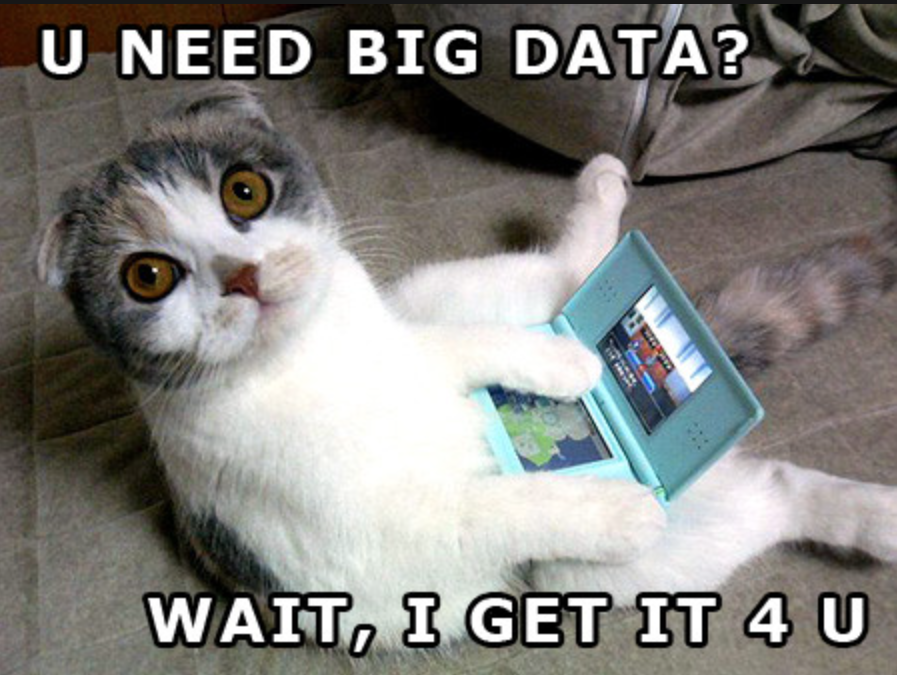

<!DOCTYPE html>
<html lang="en">
<head>
    <meta charset="UTF-8">
    <meta name="viewport" content="width=device-width, initial-scale=1.0">
    <title>My Portfolio</title>
    
    <link rel="stylesheet" href="https://fonts.googleapis.com/css2?family=Press+Start+2P&display=swap">
</head>
<body>
    <header>
        

          <h1 style="font-size: 14px; font-family: 'Courier New', Courier, monospace; color: #4d2600;">Hi, I am Hannah Shane Kate Pahama</h1>
           
          <h1 style="color: #f4e285">༘⋆₊✨°⊹★🪐࣭⭑⋆｡⊹࣪ </h1>
           
          <h1 class="pixelized">Welcome to my Portfolio!</h1>
          <h1 style="font-size: 14px; font-family: 'Courier New', Courier, monospace; color: #4d2600;">Feel free to traverse through some information about me...</h1>
        

    </header>
    <section id="about">
        <h2>✦About Me</h2>
        
Meet me, the ultimate aficionado of life's simple pleasures—music, food, and books. You'll often find me grooving to tunes, indulging in delicious eats, and getting lost in the pages of a captivating novel. But when it's time for shut-eye, deadlines be darned! I nap like a seasoned pro, turning snooze time into an art form. And amidst the chaos of existence, I'm the curious cat pondering life's mysteries, all while embracing stoicism with the calm demeanor of a Zen master—stoic yet secretly amused by the cosmic joke.

    </section>
    <section id="expectations">
        <h2>✦Expectations</h2>
        

            In this course, I am eager to deepen my understanding of ethical considerations in data science and refine my collaborative skills. Additionally, I seek to enhance my knowledge of data analytics and strengthen my writing abilities that I may apply in my professional endeavors. Through this course, I anticipate gaining insights into navigating ethical dilemmas in data-driven decision-making and honing my capacity to work effectively within interdisciplinary teams. By focusing on both ethical frameworks and communication skills, I aim to emerge equipped to contribute meaningfully to data-driven projects while articulating insights with clarity and precision.
        

    </section>
    <section id="contact">
        <h2>✦Contact Me</h2>
        
You can reach me at hpahama@willamette.edu

        
Youtube: @aye_sing

    </section>
    
    <footer>
        
&copy; 2024 My Portfolio

    </footer>
</body>
</html>

&lt; !DOCTYPE html&gt;

